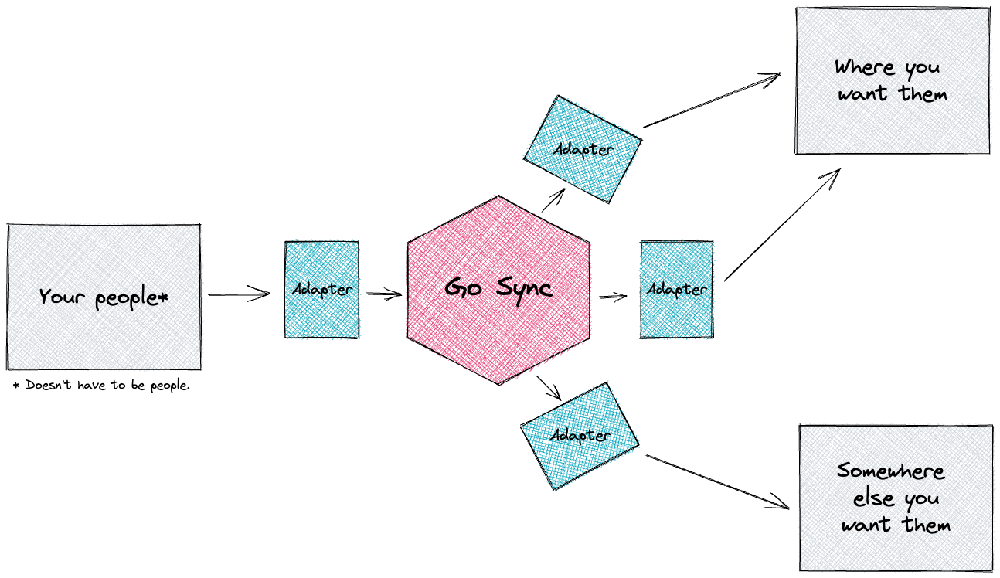

| **⚠️ Go Sync is under active development and subject to breaking changes.** |
|-----------------------------------------------------------------------------|

# Go Sync (all the things)

<div align="center">

[](packages/gosync/go.mod)
[](https://goreportcard.com/report/github.com/ovotech/go-sync/packages/gosync)
[](https://pkg.go.dev/github.com/ovotech/go-sync/packages/gosync)
[](https://github.com/ovotech/go-sync/actions/workflows/test.yml)
[](https://github.com/ovotech/go-sync/issues)
[](https://github.com/ovotech/go-sync/pull-requests)
[](/LICENSE)

</div>



You have people*. You have places you want them to be. Go Sync makes it happen.

_* Doesn't have to be people._

## Installation

```shell
# Install Go Sync.
go get github.com/ovotech/go-sync/packages/gosync@latest

# Then install any extra packages you need e.g.
go get github.com/ovotech/go-sync/packages/slack@latest
```

You're ready to Go Sync! 🎉

## Usage

```go
ctx := context.Background()

// Initialise a new source adapter.
source, err := src.Init(ctx, map[gosync.ConfigKey]string{
    src.SomeSecret: "something",
})
if err != nil {
    log.Fatal(err)
}

// Initialise a destination adapter.
destination, err := dest.Init(ctx, map[gosync.ConfigKey]string{
	dest.AnotherSecret: "something-else",
})
if err != nil {
	log.Fatal(err)
}

sync := gosync.New(source)

// Synchronise the users in the destination with the source.
err := sync.SyncWith(ctx, destination)
if err != nil {
	log.Fatal(err)
}
```

## Packages

This monorepo contains several Go modules that can all be installed independently of each other.

| Directory                                   | Documentation                                                                 | Description                                               |
|---------------------------------------------|-------------------------------------------------------------------------------|-----------------------------------------------------------|
| [github](./packages/github)                 | [Link](https://pkg.go.dev/github.com/ovotech/go-sync/packages/github)         | Synchronise emails with a GitHub team                     |
| [google](./packages/google)                 | [Link](https://pkg.go.dev/github.com/ovotech/go-sync/packages/google)         | Synchronise emails with a Google Group                    |
| [gosync](./packages/google)                 | [Link](https://pkg.go.dev/github.com/ovotech/go-sync/packages/gosync)         | Main Go Sync module                                       |
| [opsgenie](./packages/opsgenie)             | [Link](https://pkg.go.dev/github.com/ovotech/go-sync/packages/opsgenie)       | Synchronise emails with Opsgenie oncall & schedule rotas  |
| [slack](./packages/slack)                   | [Link](https://pkg.go.dev/github.com/ovotech/go-sync/packages/slack)          | Synchronise emails with Slack conversations & user groups |
| [terraformcloud](./packages/terraformcloud) | [Link](https://pkg.go.dev/github.com/ovotech/go-sync/packages/terraformcloud) | Synchronise emails with Terraform Cloud users & teams     |

### Made with 💚 by OVO Energy's DevEx team

<div>


</div>
